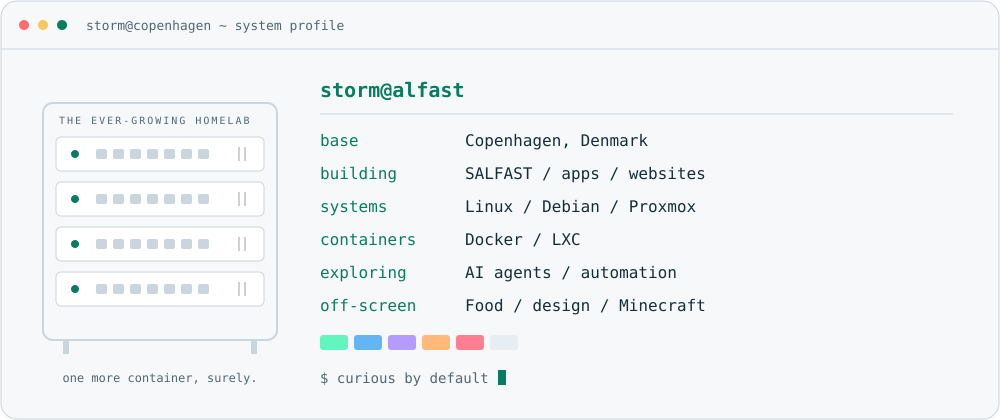

<picture>
  <source media="(prefers-color-scheme: dark)" srcset="./assets/header.svg">
  
</picture>

  <a href="https://salfast.com"><strong>SALFAST ↗</strong></a>
  &nbsp;&nbsp; / &nbsp;&nbsp;
  <a href="#the-workbench"><strong>THE WORKBENCH ↓</strong></a>
  &nbsp;&nbsp; / &nbsp;&nbsp;
  <a href="https://github.com/stormak22?tab=repositories"><strong>REPOSITORIES ↗</strong></a>

 

### Hey, I'm Storm.

I build websites, apps and automations through **[SALFAST](https://salfast.com)**. I'm into good design, useful software and understanding what happens under the hood.

That curiosity also explains the growing collection of servers at home. A perfectly reasonable hobby. Probably.

 

<picture>
  <source media="(prefers-color-scheme: dark)" srcset="./assets/system-dark.svg">
  
</picture>

 

<h3 id="the-workbench">The workbench</h3>

<table>
<tr>
<td width="50%" valign="top">
<h4>01 / SALFAST</h4>

Websites, apps and tools that solve everyday problems. I like taking a rough idea and turning it into something people can actually use.

<a href="https://salfast.com"><strong>Visit SALFAST ↗</strong></a>

</td>
<td width="50%" valign="top">
<h4>02 / THE HOMELAB</h4>

Linux, containers, networking and a growing rack. My place to experiment, break things and document how I got them working again.

<code>build → test → document → repeat</code>

</td>
</tr>
</table>

 

<strong>A little more behind the terminal</strong>

 

- **Currently exploring:** AI agents, automation and connecting systems.
- **What catches my eye:** thoughtful design and tools that make someone's day easier.
- **Away from the keyboard:** cooking for friends, creative projects and Minecraft.
- **My approach:** start small, get it working, keep improving.

Learning by doing. Occasionally doing it twice because I skipped the documentation.

 

---

  Copenhagen, Denmark · Curious by default.

