<p align="center">
  
</p>

<p align="center">
  <a href="https://salfast.com"><strong>SALFAST ↗</strong></a>
  &nbsp;&nbsp; / &nbsp;&nbsp;
  <a href="https://github.com/stormak22?tab=repositories"><strong>REPOSITORIES ↗</strong></a>
</p>

<br>

### Hey, I'm Storm.

A builder from Copenhagen with a thing for useful software, good design and running my own infrastructure.

I work on websites, apps and automations through **[SALFAST](https://salfast.com)**. Away from that, I'm usually tinkering with Linux, containers or a homelab that somehow keeps getting bigger.

**I like understanding how things work. Building them is usually how I find out.**

<br>

### What I'm into

<table>
<tr>
<td width="33%" valign="top">

**01 / BUILD**

Websites, apps and practical tools.<br><br>
From a rough idea to something someone can actually use.

</td>
<td width="33%" valign="top">

**02 / AUTOMATE**

Less repetitive work.<br><br>
Exploring AI and connecting systems to make everyday tasks easier.

</td>
<td width="33%" valign="top">

**03 / SELF-HOST**

My hardware. My rabbit hole.<br><br>
Linux, Docker, Proxmox, networking and learning by doing.

</td>
</tr>
</table>

<br>

### On my workbench

```yaml
focus:
  - Building useful software with SALFAST
  - Growing my homelab and documenting what I learn
  - Exploring AI agents and automation

infrastructure:
  systems:     [Linux, Debian, Proxmox]
  containers:  [Docker, LXC]
  networking:  [Cloudflare, Caddy]

approach: "Start small. Get it working. Keep improving."
```

<br>

---

<p align="center">
  <sub>Built with curiosity. Occasionally fixed with coffee.</sub>
</p>
